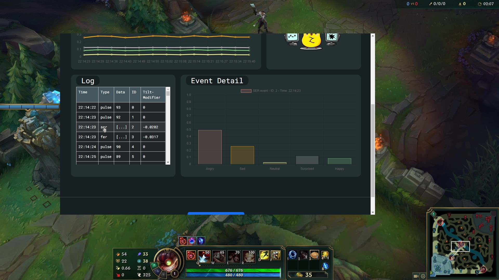

# README


## About

The "Tilt-O-Meter" is a real time multi-app software that can collect, interpret and display various types of sensor data on a user playing League of Legends. In the current implementation, utilized sensor data include:
-  (face) camera images
-  voice input
-  heart rate

After the collection of data, Emotions are predicted for both image and voice input. As opposed to earlier iterations of the "Tilt-O-Meter", custom models are used for facial expression recognition (FER) and speech emotion recognition (SER).

To complement the sensor data the following League of Legends game events are detected in the current implementation of the "Tilt-O-Meter":
- kill
- death
- assist

The "Tilt-O-Meter" is a work in progress.
The goal of the "Tilt-O-Meter" is to infer a user's level of tilt in real time as accurately as possible. In gaming, tilt refers to the vicious cycle of committing to unfavourable decisions in order to make up for past setbacks.


<!-- ## Screenshots -->

graphs and tilt value             |  Event log and details
:-------------------------:|:-------------------------:
  |  


## App components
The "Tilt-O-Meter" consists of 5 different components:
- Websocket Server
  - Broadcasts websocket messages between components
- Device-Manager (Svelte webserver)
  - captures camera input, mic input and heart rate
- FER docker container
  - takes in audio stream and predicts emotions from it
- SER docker container
  - takes in images and predicts emotions from it
- custom Overwolf extension
  - captures game events
  - renders output to user as overlay

### Component modularization

The architecture of the app allows for almost any of the components to be absent without effecting the functionality of the remaining components. For example, if the SER-docker container was never turned on, everything in the app will still be fully funtional with the exception that no SER-results will be accounted for. One exception to this rule is the webserver which - if left turned off - will render most of the other components useless as none of their input/output will be forwarded. Without the websocket server, the FER and SER containers will also quit upon launch as they expect a workable socket connection.


## Requirements
In order to run the "Tilt-O-Meter", the following requirements must be met:
- docker installed (for SER and FER)
- node installed
- Overwolf installed
- browser installed that supports web bluetooth, i.e. Chrome (see: [web bluetooth browser support](https://caniuse.com/web-bluetooth))


## Build the app


### build device-manager

```
cd device-manager
npm install
```
### build FER
```
cd facial-expression-rec/
docker build -t fer .
```

If you want to use the same model we have trained and used please get in touch. Otherwise, add your model to `./facial-expression-rec/` and adapt the code inside `./facial-expression-rec/fer.py` according to your models output format and file name.  

### build SER
```
cd speech-emotion-rec/
docker build -t ser .
```

If you want to use the same model we have trained and used please get in touch. Otherwise, add your model to `./speech-emotion-rec/` and adapt the code inside `./speech-emotion-rec/ser.py` according toyour models output format.  

### build Overwolf-extension

#### License unclear

A lot of the code inside the 'overwolf' directory was developed by using the [Overwolf Sample App](https://github.com/overwolf/sample-app) as a starting point. Since no license has been specified by Overwolf for the code inside the [Overwolf Sample App](https://github.com/overwolf/sample-app), we unfortunately can't include the unlicensed extension code inside this repository.

In order to run the code from 'overwolf' directory, follow these steps:
1. clone the Overwolf Sample App at the root level of this repository
2. move all files from this directory into the Overwolf Sample App (replace existing files)
3. delete this - now empty - directory
4. rename the Overwolf Sample App directory to 'overwolf'

After the template's code has been added, run the following commands: 

```
cd overwolf/ts
npm install
npm run build
```
Then, load the extension under development options as "Unpacked extension" by specifying the path to `overwolf/ts/dist` 
(see: ["load app as unpacked extension" in the Overwolf documentation](https://overwolf.github.io/start/basic-app/sample-app#5-load-the-app-as-unpacked-extension)).

If the extension's dekstop window remains upon game launch, try enabling in_game windows for League of Legends in Overwolf.

## Run the apps
In order to run the "Tilt-O-Meter", the 

1. Run websocket server
    ```
    node server/server.js
    ```
2. Run device-manager
    ```
    cd device-manager/
    npm run dev
    ```
    - Pair Polar H10 belt
    - Start mic input
3. Run FER
    ```
    docker run --rm fer
    ```
4. Run SER
    ```
    docker run --rm ser
    ```
5. Run the Overwolf extension (from shortcut or development options)
1. Run League of Legends